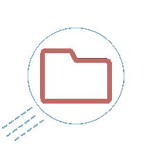

# Home Uploader

Forked from original repository to maintain and configure for private networks (LAN) like **Home**, In order to create a simple file uploader.

* Added **pm2** in order to act like a server.
* Added **HTTPS** with self signed certificate (auto create).

## *Original Source*: **[Filing Saucer](https://github.com/enbytedev/Filing-Saucer-V1)**

---

>"like a flying saucer, but for files... like in the cloud..."

>A file sharing server with a full web client! Users may also use an API via POST and GET requests to exchange files.

